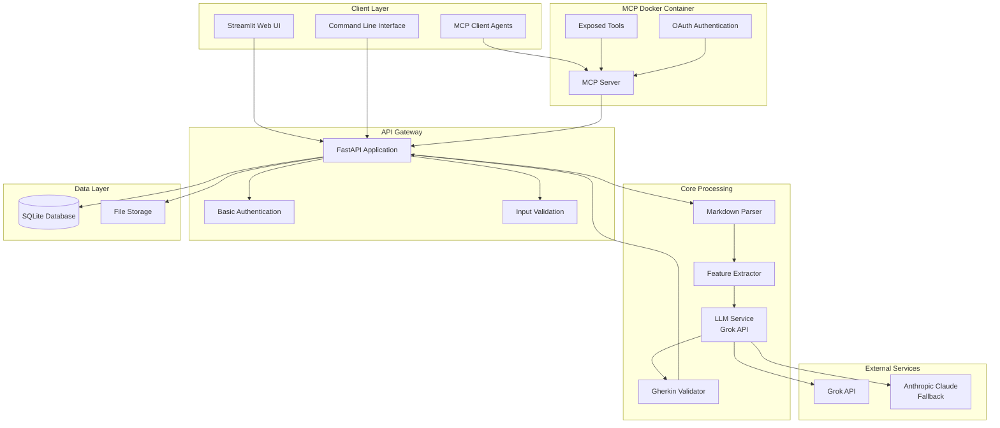

# AI Agent Guide for QA Scenario Writer

This guide provides essential information for AI agents working on the QA Scenario Writer MVP project.

## Project Overview

The QA Scenario Writer is a simple tool that automates BDD scenario generation from Markdown documents. It uses a simplified monolithic architecture with MCP Docker integration for external agent access.

## Key Documents

### Planning Documents
- **[Project Analysis 2025](../planning/project/Project_Analysis_2025.md)** - Comprehensive analysis and technology recommendations
- **[Simplified MVP Approach 2025](../planning/implementation/Simplified_MVP_Approach_2025.md)** - **RECOMMENDED** - Practical 4-6 week approach
- **[Architecture Overview 2025](../planning/implementation/Architecture_Overview_2025.md)** - **CURRENT** - MCP Docker architecture
- **[Systems Thinking Analysis Response](../planning/implementation/Systems_Thinking_Analysis_Response.md)** - Analysis of over-engineering and corrections

### Implementation Documents
- **[Phase 1: Core Backend](../planning/implementation/Phase_1_Core_Backend.md)** - Week 1 implementation
- **[Phase 2: LLM Integration](../planning/implementation/Phase_2_LLM_Integration.md)** - Week 2 implementation
- **[Phase 3: Frontend & Export](../planning/implementation/Phase_3_Frontend_Export.md)** - Week 3 implementation
- **[Phase 4: MCP Integration](../planning/implementation/Phase_4_MCP_Integration.md)** - Week 4 implementation

### User Documentation
- **[Getting Started](user-guide/getting-started.md)** - Quick start guide
- **[API Reference](api-reference/endpoints.md)** - Complete API documentation
- **[Architecture Guide](developer-guide/architecture.md)** - System design details

## Technology Stack (Simplified MVP)

### Core Framework
- **FastAPI 0.104+** - Simple, fast web framework
- **Pydantic V2** - Data validation
- **SQLite** - File-based database (MVP)
- **Streamlit 1.28+** - Rapid UI development

### AI/ML Integration
- **Grok API** - Primary LLM provider
- **Anthropic Claude** - Fallback provider
- **OpenAI Client** - API compatibility

### Document Processing
- **Markdown-it-py** - Markdown parsing
- **spaCy** - NLP processing
- **Custom validation** - Document structure validation
- **Only .md files supported** - All document transformations must be completed before processing

### MCP Integration
- **MCP Protocol** - Tool communication
- **Docker** - Containerization
- **OAuth 2.0** - Authentication
- **JWT** - Token-based auth

### Infrastructure
- **Docker** - Simple containerization
- **SQLite** - File-based database
- **File Storage** - Local file system

## Architecture Overview



## Service Boundaries

### Document Processing Service
- **Responsibilities**: Markdown parsing only, validate document structure and content, ensure document transformations are complete before processing
- **Input**: Markdown documents (.md files only)
- **Output**: Parsed features with user stories and acceptance criteria
- **Dependencies**: markdown-it-py, custom validation

### Scenario Generation Service
- **Responsibilities**: Generate BDD scenarios using LLM, validate Gherkin syntax, handle multiple test types
- **Input**: Parsed features
- **Output**: Gherkin-formatted scenarios
- **Dependencies**: Grok API, Anthropic Claude (fallback)

### MCP Service
- **Responsibilities**: Expose tools for external agents, handle OAuth authentication, rate limiting
- **Input**: Tool requests from external agents
- **Output**: Tool responses
- **Dependencies**: MCP protocol, OAuth 2.0

## Data Flow

### Web UI Workflow
```
Markdown Document Upload → Validate Format → Parse → Extract Features → Generate Scenarios → Create Tests → Export
```

### MCP Agent Workflow
```
Agent Request → MCP Server → FastAPI → Processing → Response → Agent
```

## Implementation Phases

### Phase 1: Core Backend (Week 1)
- FastAPI setup with basic endpoints
- Markdown parsing with markdown-it-py
- SQLite database for results storage
- Basic error handling and logging

### Phase 2: LLM Integration (Week 2)
- Grok API integration
- Prompt engineering for Gherkin generation
- Basic scenario generation
- Simple validation (syntax check)

### Phase 3: Frontend & Export (Week 3)
- Streamlit web interface
- File upload/download functionality
- .feature file export
- Basic error messages and user feedback

### Phase 4: MCP Integration (Week 4)
- MCP server implementation
- Docker container for MCP
- OAuth authentication for external agents
- Tool exposure and API integration

## MCP Tools Available

### Core Tools
- **`generate_scenarios`**: Generate BDD scenarios from a document
- **`parse_document`**: Parse and validate Markdown input
- **`validate_gherkin`**: Validate generated Gherkin syntax
- **`export_feature`**: Export scenarios to .feature files

### Utility Tools
- **`list_documents`**: List all documents
- **`get_document`**: Get document details
- **`health_check`**: Check service health

## API Endpoints

### Core Endpoints
- `POST /documents/upload` - Upload Markdown document
- `GET /documents/{id}` - Get document details
- `POST /scenarios/generate` - Generate BDD scenarios
- `POST /scenarios/export` - Export scenarios

### MCP Endpoints
- `GET /mcp/tools` - List available tools
- `POST /mcp/execute` - Execute MCP tool

## Configuration

### Environment Variables
```bash
# Database
DATABASE_URL=sqlite:///./qa_scenarios.db

# LLM APIs
GROK_API_KEY=your-grok-api-key
ANTHROPIC_API_KEY=your-anthropic-api-key

# MCP Configuration
MCP_SERVER_URL=http://qa-scenario-writer:8000/api/v1
MCP_AUTH_TOKEN=your-mcp-auth-token
JWT_SECRET=your-jwt-secret
```

## Development Guidelines

### Code Organization
- **Modular Design**: Clear separation of concerns
- **Interface-Based**: Easy to swap implementations
- **Configuration-Driven**: Environment-based settings
- **Error Handling**: Comprehensive error management

### Testing Strategy
- **Unit Tests**: Core parsing and generation logic
- **Integration Tests**: End-to-end workflow
- **User Testing**: Real user stories from different domains
- **Manual Review**: Generated scenarios reviewed by BDD experts

### Performance Considerations
- **Caching**: Simple in-memory caching for repeated requests
- **Async Processing**: Non-blocking I/O where possible
- **Resource Management**: Proper cleanup of resources
- **Monitoring**: Basic performance metrics

## Common Tasks

### Adding New LLM Provider
1. Create new provider class implementing `LLMProvider` interface
2. Add provider to `LLMService` configuration
3. Update fallback order in settings
4. Add provider-specific error handling

### Adding New Export Format
1. Create new export method in `ExportService`
2. Add format to supported formats list
3. Update API endpoint to handle new format
4. Add format-specific validation

### Adding New MCP Tool
1. Define tool parameters and description
2. Implement tool execution method
3. Add tool to MCP server tools list
4. Update API documentation

## Troubleshooting

### Common Issues
1. **LLM API Failures**: Check API keys and network connectivity
2. **MCP Authentication Issues**: Verify JWT secret and OAuth configuration
3. **Database Issues**: Check SQLite file permissions and disk space
4. **Docker Issues**: Check container logs and port mappings

### Debugging
- **Application Logs**: Check structured logs for errors
- **Health Checks**: Verify service availability
- **API Documentation**: Use FastAPI's built-in docs
- **MCP Tools**: Test individual tools via MCP client

## Best Practices

### Code Quality
- Follow Python PEP 8 style guidelines
- Use type hints for all function parameters and return values
- Write comprehensive docstrings
- Implement proper error handling

### Security
- Validate all inputs
- Use parameterized queries for database operations
- Implement proper authentication and authorization
- Log security-relevant events

### Performance
- Use async/await for I/O operations
- Implement caching where appropriate
- Monitor resource usage
- Optimize database queries

## Getting Help

- **Documentation**: Check the implementation guide for technical details
- **Issues**: Report bugs and feature requests
- **Examples**: See the phase-specific implementation docs
- **Logs**: Check application logs for detailed error messages

## Key Principles

1. **Simplicity First**: Build the simplest thing that could work
2. **MCP Integration**: Expose tools for external agent access
3. **Modular Design**: Clear separation of concerns
4. **Configuration-Driven**: Environment-based settings
5. **Error Handling**: Comprehensive error management
6. **User-Centric**: Focus on user value, not technical metrics

This guide provides the essential information needed to work effectively on the QA Scenario Writer MVP project. The simplified approach focuses on core value while maintaining flexibility for future enhancements.