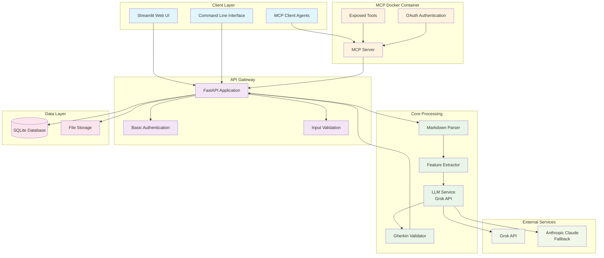

# QA Scenario Writer - Architecture Overview 2025

## System Architecture



## Architecture Principles

### **1. MCP-First Design**
- **Tool Exposure**: Core functionality exposed via MCP tools
- **Agent Integration**: External agents can use tools without direct API access
- **Docker Containerization**: MCP server runs in isolated container
- **OAuth Security**: Secure authentication for external access

### **2. Simple Core Architecture**
- **Monolithic Backend**: FastAPI application with clear modules
- **SQLite Database**: Simple file-based storage for MVP
- **Streamlit Frontend**: Rapid UI development
- **Docker Deployment**: Single container for easy deployment

### **3. Modular Design**
- **Clear Separation**: Parser, Extractor, LLM, Validator modules
- **Interface-Based**: Easy to swap components
- **Configuration-Driven**: Environment-based settings
- **Extensible**: Easy to add new features

## Component Details

### **Client Layer**

#### Streamlit Web UI
- **Purpose**: Primary user interface
- **Features**: File upload, scenario generation, download
- **Technology**: Streamlit 1.28+
- **Deployment**: Embedded in main application

#### Command Line Interface
- **Purpose**: Developer and automation access
- **Features**: Batch processing, script integration
- **Technology**: Click or Typer
- **Usage**: `qa-scenario generate input.md --output scenarios.feature`

#### MCP Client Agents
- **Purpose**: External agent integration
- **Features**: Tool discovery, secure authentication
- **Technology**: MCP protocol
- **Access**: Via Docker MCP container

### **API Gateway (FastAPI)**

#### Core Endpoints
```python
# Document Processing
POST /documents/upload          # Upload Markdown file
GET  /documents/{id}            # Get document details
POST /documents/{id}/process    # Process document

# Scenario Generation
POST /scenarios/generate        # Generate BDD scenarios
GET  /scenarios/{id}            # Get generated scenarios
POST /scenarios/{id}/export     # Export to .feature file

# MCP Integration
GET  /mcp/tools                 # List available MCP tools
POST /mcp/execute               # Execute MCP tool
```

#### Authentication
- **Basic Auth**: Username/password for web UI
- **API Keys**: For programmatic access
- **OAuth**: For MCP external agents

### **Core Processing Modules**

#### Markdown Parser
```python
class MarkdownParser:
    def parse_document(self, content: str) -> Document:
        """Parse Markdown and extract structure"""
        
    def validate_structure(self, content: str) -> ValidationResult:
        """Validate required sections and format"""
```

#### Feature Extractor
```python
class FeatureExtractor:
    def extract_features(self, document: Document) -> List[Feature]:
        """Extract user stories and acceptance criteria"""
        
    def extract_user_stories(self, content: str) -> List[UserStory]:
        """Parse user stories from content"""
```

#### LLM Service
```python
class LLMService:
    def generate_scenarios(self, feature: Feature) -> str:
        """Generate BDD scenarios using Grok API"""
        
    def health_check(self) -> bool:
        """Check LLM service availability"""
```

#### Gherkin Validator
```python
class GherkinValidator:
    def validate_syntax(self, gherkin: str) -> ValidationResult:
        """Validate Gherkin syntax"""
        
    def validate_completeness(self, gherkin: str) -> ValidationResult:
        """Check for complete scenarios"""
```

### **MCP Docker Container**

#### MCP Server
```python
class MCPServer:
    def __init__(self):
        self.tools = {
            "generate_scenarios": self.generate_scenarios_tool,
            "parse_document": self.parse_document_tool,
            "validate_gherkin": self.validate_gherkin_tool,
            "export_feature": self.export_feature_tool
        }
    
    async def generate_scenarios_tool(self, document_id: str) -> str:
        """MCP tool for scenario generation"""
        
    async def parse_document_tool(self, content: str) -> dict:
        """MCP tool for document parsing"""
```

#### Exposed MCP Tools
- **`generate_scenarios`**: Generate BDD scenarios from document
- **`parse_document`**: Parse and validate Markdown input
- **`validate_gherkin`**: Validate generated Gherkin syntax
- **`export_feature`**: Export scenarios to .feature files

#### Docker Configuration
```yaml
# docker-compose.yml
version: '3.8'
services:
  qa-scenario-writer:
    build: .
    ports:
      - "8000:8000"
    environment:
      - DATABASE_URL=sqlite:///./qa_scenarios.db
      - GROK_API_KEY=${GROK_API_KEY}
    volumes:
      - ./data:/app/data
      
  mcp-server:
    build: ./mcp
    ports:
      - "8001:8001"
    environment:
      - MCP_SERVER_URL=http://qa-scenario-writer:8000
      - MCP_AUTH_TOKEN=${MCP_AUTH_TOKEN}
    depends_on:
      - qa-scenario-writer
```

### **Data Layer**

#### SQLite Database
```sql
-- Documents table
CREATE TABLE documents (
    id TEXT PRIMARY KEY,
    filename TEXT NOT NULL,
    content TEXT,
    created_at TIMESTAMP DEFAULT CURRENT_TIMESTAMP
);

-- Features table
CREATE TABLE features (
    id TEXT PRIMARY KEY,
    document_id TEXT REFERENCES documents(id),
    title TEXT NOT NULL,
    user_stories TEXT,
    acceptance_criteria TEXT,
    created_at TIMESTAMP DEFAULT CURRENT_TIMESTAMP
);

-- Scenarios table
CREATE TABLE scenarios (
    id TEXT PRIMARY KEY,
    feature_id TEXT REFERENCES features(id),
    content TEXT NOT NULL,
    test_type TEXT,
    created_at TIMESTAMP DEFAULT CURRENT_TIMESTAMP
);
```

#### File Storage
- **Input Files**: Uploaded Markdown documents
- **Output Files**: Generated .feature files
- **Templates**: BDD scenario templates
- **Logs**: Application and error logs

## Data Flow

### **1. Web UI Workflow**
```
User Upload → FastAPI → Parser → Extractor → LLM → Validator → Database → Download
```

### **2. MCP Agent Workflow**
```
Agent Request → MCP Server → FastAPI → Processing → Response → Agent
```

### **3. CLI Workflow**
```
CLI Command → FastAPI → Processing → File Output
```

## Security Model

### **Web UI Security**
- **Basic Authentication**: Username/password
- **Session Management**: JWT tokens
- **Input Validation**: Sanitize all inputs
- **File Upload Limits**: Size and type restrictions

### **MCP Security**
- **OAuth 2.0**: Secure external agent authentication
- **Token-Based**: API tokens for tool access
- **Rate Limiting**: Prevent abuse
- **CORS**: Configured for specific origins

### **Data Security**
- **Input Sanitization**: Clean all user inputs
- **File Validation**: Check file types and content
- **Database Security**: Parameterized queries
- **Logging**: Audit trail for all operations

## Deployment Architecture

### **Development Environment**
```bash
# Local development
docker-compose up -d

# Access points
Web UI: http://localhost:8000
MCP Server: http://localhost:8001
API Docs: http://localhost:8000/docs
```

### **Production Environment**
```bash
# Production deployment
docker-compose -f docker-compose.prod.yml up -d

# With reverse proxy
nginx → FastAPI (port 8000)
nginx → MCP Server (port 8001)
```

## Technology Stack

### **Backend**
- **FastAPI 0.104+**: Web framework
- **SQLite**: Database
- **Pydantic**: Data validation
- **spaCy**: NLP processing

### **Frontend**
- **Streamlit 1.28+**: Web UI
- **HTML/CSS**: Styling
- **JavaScript**: Client-side interactions

### **MCP Integration**
- **MCP Protocol**: Tool communication
- **Docker**: Containerization
- **OAuth 2.0**: Authentication

### **External Services**
- **Grok API**: Primary LLM
- **Anthropic Claude**: Fallback LLM

## Scalability Considerations

### **Current Design (MVP)**
- **Single Instance**: One FastAPI application
- **SQLite Database**: File-based storage
- **Synchronous Processing**: Simple request/response

### **Future Scaling (Post-MVP)**
- **Horizontal Scaling**: Multiple FastAPI instances
- **PostgreSQL**: Relational database
- **Redis**: Caching and session storage
- **Async Processing**: Background task queues

## Monitoring and Observability

### **Basic Monitoring (MVP)**
- **Application Logs**: Structured logging
- **Error Tracking**: Exception handling
- **Health Checks**: Service availability
- **Basic Metrics**: Request count, response time

### **Advanced Monitoring (Post-MVP)**
- **Prometheus**: Metrics collection
- **Grafana**: Dashboards
- **Jaeger**: Distributed tracing
- **ELK Stack**: Log aggregation

This architecture provides a solid foundation for the MVP while maintaining flexibility for future enhancements. The MCP integration allows external agents to use the tools without direct API access, and the Docker containerization ensures easy deployment and scaling.
