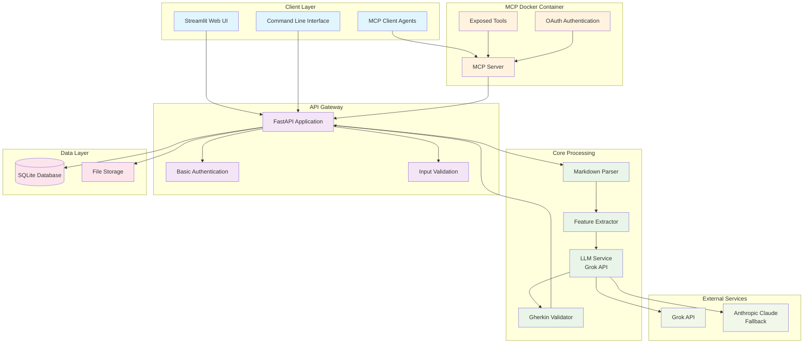

# QA Scenario Writer - Implementation Guide

## Overview

This directory contains the implementation documentation for the QA Scenario Writer project, organized by development phases. The project follows a simplified MVP approach with MCP Docker integration for external agent access.

## Architecture



## Implementation Phases

### Phase 1: Core Backend (Week 1)
**File**: [Phase_1_Core_Backend.md](Phase_1_Core_Backend.md)

**Deliverables**:
- FastAPI application with basic endpoints
- Markdown parsing with markdown-it-py
- SQLite database for results storage
- Basic error handling and logging
- Docker containerization

**Key Components**:
- Document upload and storage
- Feature extraction from Markdown
- Basic validation
- Database models and operations

### Phase 2: LLM Integration (Week 2)
**File**: [Phase_2_LLM_Integration.md](Phase_2_LLM_Integration.md)

**Deliverables**:
- Grok API integration
- Prompt engineering for Gherkin generation
- Basic scenario generation
- Simple validation (syntax check)
- Error handling and retry logic

**Key Components**:
- LLM service with fallback
- Scenario generation logic
- Gherkin validation
- Retry mechanisms

### Phase 3: Frontend & Export (Week 3)
**File**: [Phase_3_Frontend_Export.md](Phase_3_Frontend_Export.md)

**Deliverables**:
- Streamlit web interface
- File upload/download functionality
- .feature file export
- Basic error messages and user feedback
- Integration with backend API

**Key Components**:
- Streamlit web UI
- Export service for multiple formats
- File handling and validation
- User experience improvements

### Phase 4: MCP Integration (Week 4)
**File**: [Phase_4_MCP_Integration.md](Phase_4_MCP_Integration.md)

**Deliverables**:
- MCP server implementation
- Docker container for MCP
- OAuth authentication for external agents
- Tool exposure and API integration
- Rate limiting and security

**Key Components**:
- MCP server with tool exposure
- OAuth authentication
- Rate limiting
- External agent access

## Technology Stack

### Core Technologies
- **FastAPI 0.104+**: Web framework
- **SQLite**: Database (MVP)
- **Streamlit 1.28+**: Web UI
- **Docker**: Containerization

### LLM Integration
- **Grok API**: Primary LLM provider
- **Anthropic Claude**: Fallback provider
- **OpenAI Client**: API compatibility

### MCP Integration
- **MCP Protocol**: Tool communication
- **OAuth 2.0**: Authentication
- **JWT**: Token-based auth

### Document Processing
- **markdown-it-py**: Markdown parsing
- **spaCy**: NLP processing
- **Pydantic**: Data validation

## Quick Start

### 1. Development Setup
```bash
# Clone repository
git clone <repository-url>
cd qa-scenario-writer

# Install dependencies
pip install -r requirements.txt

# Start development server
python main.py
```

### 2. Docker Setup
```bash
# Build and start all services
docker-compose -f docker-compose.mcp.yml up -d

# Access services
# Web UI: http://localhost:8501
# API: http://localhost:8000
# MCP Server: http://localhost:8001
```

### 3. MCP Client Example
```python
from mcp_client_example import MCPClient

client = MCPClient("http://localhost:8001", "your-auth-token")

# Generate scenarios
result = await client.generate_scenarios("document-id")
print(result)
```

## API Endpoints

### Document Management
- `POST /api/v1/documents/upload` - Upload Markdown document
- `GET /api/v1/documents/{id}` - Get document details
- `GET /api/v1/documents/` - List all documents

### Scenario Generation
- `POST /api/v1/scenarios/generate` - Generate BDD scenarios
- `GET /api/v1/scenarios/{id}` - Get scenario details
- `POST /api/v1/scenarios/export` - Export scenarios

### MCP Tools
- `GET /mcp/tools` - List available tools
- `POST /mcp/execute` - Execute MCP tool

## Configuration

### Environment Variables
```bash
# Database
DATABASE_URL=sqlite:///./qa_scenarios.db

# LLM APIs
GROK_API_KEY=your-grok-api-key
ANTHROPIC_API_KEY=your-anthropic-api-key

# MCP Configuration
MCP_SERVER_URL=http://qa-scenario-writer:8000/api/v1
MCP_AUTH_TOKEN=your-mcp-auth-token
JWT_SECRET=your-jwt-secret
```

## Success Criteria

### Technical Success
- [ ] Generate valid Gherkin from 90% of inputs
- [ ] Complete workflow in <2 minutes
- [ ] Handle 10+ concurrent users
- [ ] Deploy with single Docker command

### Business Success
- [ ] 5+ users actively using the tool
- [ ] 70% reduction in scenario authoring time
- [ ] Positive user feedback (>4.0/5)
- [ ] Clear path to next version

## Post-MVP Roadmap

### Version 2: Reliability (3-6 months)
- Multi-LLM fallback
- Advanced error handling
- Performance optimization
- Basic monitoring

### Version 3: Enterprise (6-12 months)
- MCP integration
- Advanced security
- Team collaboration features
- CI/CD integration

### Version 4: Intelligence (12+ months)
- Custom model training
- Advanced analytics
- Predictive scenario generation
- Domain-specific optimization

## Troubleshooting

### Common Issues

1. **LLM API Failures**
   - Check API keys and network connectivity
   - Verify rate limits and quotas
   - Check fallback provider configuration

2. **MCP Authentication Issues**
   - Verify JWT secret configuration
   - Check OAuth client credentials
   - Validate token expiration

3. **Database Issues**
   - Check SQLite file permissions
   - Verify database schema
   - Check disk space

4. **Docker Issues**
   - Check container logs
   - Verify port mappings
   - Check volume mounts

### Getting Help

- Check the [Architecture Overview](Architecture_Overview_2025.md) for system design
- Review phase-specific documentation for implementation details
- Check logs for error messages and debugging information

## Contributing

1. Follow the phase-based implementation approach
2. Maintain backward compatibility
3. Add tests for new features
4. Update documentation as needed
5. Follow the simplified MVP principles

## License

[Add your license information here]
