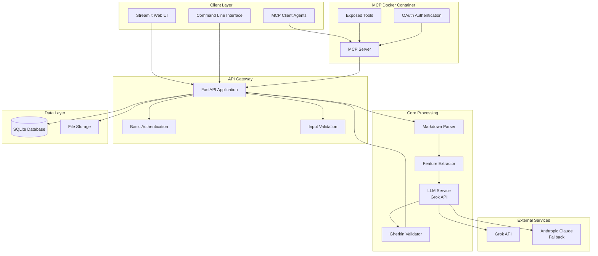

# QA Scenario Writer Project Analysis 2025 - V3.0 (Refined MVP)

**Version**: 3.0 (Refined MVP Approach)  
**Date**: January 2025  
**Status**: Current - Practical 4-6 week approach with MCP integration

## Executive Summary

The QA Scenario Writer is a practical tool that automates BDD scenario generation from natural language inputs. This refined analysis focuses on core value: **democratizing BDD by reducing manual scenario authoring from hours to minutes**.

**Key Principle**: Build the simplest thing that could work, then iterate based on real user feedback.

## Core Value Proposition

**Transform**: Manual Gherkin writing (hours) → Automated scenario generation (minutes)  
**Target**: 70% reduction in BDD authoring time  
**Users**: Developers, QA engineers, product managers who need BDD scenarios

## Refined Technology Stack (MVP)

### **Core Stack (Proven & Simple)**
```yaml
# Backend
fastapi: ">=0.104.0"          # Simple, fast API
uvicorn: ">=0.24.0"           # ASGI server
pydantic: ">=2.0.0"           # Data validation

# Document Processing
markdown-it-py: ">=3.0.0"     # Markdown parsing
spacy: ">=3.7.0"              # NLP for entity extraction

# LLM Integration
openai: ">=1.0.0"             # Grok API (via OpenAI client)
anthropic: ">=0.8.0"          # Fallback option

# Database (Simple)
sqlite: "built-in"            # File-based, no setup needed

# Frontend
streamlit: ">=1.28.0"         # Simple web UI (faster than React)

# MCP Integration
mcp: "latest"                 # MCP protocol
oauth2: ">=1.0.0"            # OAuth authentication
jwt: ">=1.0.0"               # JWT tokens

# Deployment
docker: "latest"              # Containerization
```

### **Why This Stack?**
- **FastAPI**: Simple, fast, great docs
- **Streamlit**: Rapid UI development, no frontend complexity
- **SQLite**: No database setup, perfect for MVP
- **spaCy**: Proven NLP, not over-engineered
- **MCP**: Perfect for tool exposure to external agents
- **Docker**: Simple deployment

## Simplified Architecture



## Refined Implementation Timeline (4-6 weeks)

### **Week 1: Core Backend**
- [ ] FastAPI setup with basic endpoints
- [ ] Markdown parsing with markdown-it-py
- [ ] SQLite database for results storage
- [ ] Basic error handling and logging

### **Week 2: LLM Integration**
- [ ] Grok API integration
- [ ] Prompt engineering for Gherkin generation
- [ ] Basic scenario generation
- [ ] Simple validation (syntax check)

### **Week 3: Frontend & Export**
- [ ] Streamlit web interface
- [ ] File upload/download functionality
- [ ] .feature file export
- [ ] Basic error messages and user feedback

### **Week 4: MCP Integration**
- [ ] MCP server implementation
- [ ] Docker container for MCP
- [ ] OAuth authentication for external agents
- [ ] Tool exposure and API integration

### **Week 5: Polish & Testing**
- [ ] End-to-end testing
- [ ] Error handling improvements
- [ ] Basic documentation
- [ ] Docker containerization

### **Week 6: Optional Enhancements**
- [ ] Basic templates for different domains
- [ ] Simple batch processing
- [ ] Export to multiple formats
- [ ] Basic analytics (generation time, success rate)

## MVP Success Criteria (Realistic)

### **Technical Success**
- [ ] Generate valid Gherkin from 90% of inputs
- [ ] Complete workflow in <2 minutes
- [ ] Handle 10+ concurrent users
- [ ] Deploy with single Docker command

### **Business Success**
- [ ] 5+ users actively using the tool
- [ ] 70% reduction in scenario authoring time
- [ ] Positive user feedback (>4.0/5)
- [ ] Clear path to next version

### **Quality Approach (Practical)**
- **Generation Success Rate**: >90% of inputs produce valid Gherkin
- **User Satisfaction**: Can generate scenarios in <2 minutes
- **Error Clarity**: Users can fix 80% of issues without help

### **What We Don't Measure (Post-MVP)**
- Academic accuracy metrics (BLEU/ROUGE)
- Complex performance benchmarks
- Enterprise security compliance
- Advanced monitoring dashboards

## Key Changes from V1.0

### **Removed Over-Engineering**
- ❌ **Dramatiq orchestration** - Unnecessary for single-user tool
- ❌ **Microservices architecture** - Premature optimization
- ❌ **Complex monitoring** - Jaeger, Prometheus for MVP
- ❌ **PostgreSQL** - SQLite is perfect for MVP
- ❌ **18-week timeline** - 4-6 weeks is realistic

### **Added Practical Features**
- ✅ **MCP Docker Integration** - Perfect for tool exposure
- ✅ **Streamlit UI** - Rapid development
- ✅ **SQLite Database** - No setup required
- ✅ **Simple Architecture** - Monolithic with clear modules
- ✅ **Realistic Timeline** - 4-6 weeks for validation

### **Focused on Core Value**
- ✅ **BDD Scenario Generation** - Core differentiator
- ✅ **Markdown Input** - Simple, structured input
- ✅ **Gherkin Output** - Standard BDD format
- ✅ **External Agent Access** - MCP tools for automation
- ✅ **User-Centric Metrics** - Time saved, satisfaction

## Risk Mitigation (Simplified)

### **Technical Risks**
1. **LLM Quality Issues**
   - **Mitigation**: Prompt engineering, fallback prompts
   - **Acceptance**: 80% of scenarios are "good enough"

2. **Input Parsing Problems**
   - **Mitigation**: Clear input format requirements
   - **Acceptance**: Handle 90% of well-formed inputs

3. **Performance Issues**
   - **Mitigation**: Simple caching, async processing
   - **Acceptance**: <30 seconds generation time

### **Business Risks**
1. **Low Adoption**
   - **Mitigation**: Focus on core value, simple UI
   - **Validation**: 5-10 pilot users confirm value

2. **Quality Concerns**
   - **Mitigation**: Human review process, clear disclaimers
   - **Acceptance**: Users understand it's a starting point

## Post-MVP Roadmap (Separate Scope)

### **Version 2: Reliability** (3-6 months post-MVP)
- Multi-LLM fallback
- Advanced error handling
- Performance optimization
- Basic monitoring

### **Version 3: Enterprise** (6-12 months post-MVP)
- MCP integration
- Advanced security
- Team collaboration features
- CI/CD integration

### **Version 4: Intelligence** (12+ months post-MVP)
- Custom model training
- Advanced analytics
- Predictive scenario generation
- Domain-specific optimization

## Key Lessons Learned

### **What Went Wrong (V1.0)**
- **Solution Architecture Mode**: Designed for enterprise scale from day 1
- **Technology Fetish**: Chose "modern" tools over simple, effective ones
- **Feature Creep**: Added "nice to have" features as core requirements
- **Academic Perfectionism**: Aimed for production-grade quality instead of MVP validation
- **Unrealistic Timeline**: 18 weeks for what should be 4-6 weeks

### **What Went Right (V3.0)**
- **Core Value Focus**: "Democratize BDD by automating scenario generation"
- **Practical Technology**: FastAPI + Streamlit + SQLite + Docker + MCP
- **Realistic Timeline**: 4-6 weeks for prototype validation
- **Quality That Matters**: "Good enough" scenarios, not academic perfection
- **MCP Integration**: Perfect for tool exposure to external agents

## Next Steps

### **Immediate Actions**
1. **Start with Week 1** - FastAPI + SQLite + Markdown parsing
2. **Get 5-10 real user stories** - For testing and validation
3. **Focus on core workflow** - Upload → Generate → Download
4. **Measure actual user value** - Not technical metrics

### **Success Validation**
- Can users generate scenarios in <2 minutes?
- Do they find the output useful?
- Would they use it again?
- What improvements do they suggest?

## Conclusion

This refined analysis focuses on **proving core value quickly** rather than building a perfect system. The MCP Docker integration provides external agent access without over-engineering, and the simplified approach delivers value faster with lower risk.

**Key Principle**: Build the simplest thing that could work, then iterate based on real user feedback.

**Timeline**: 4-6 weeks to validate core value, not 18 weeks to build enterprise features.

**Success**: Users can generate useful BDD scenarios quickly, not perfect scenarios with complex validation.

---

**Previous Versions**:
- [V1.0 (Over-Engineered)](archive/v1.0/Project_Analysis_2025.md) - Original 18-week enterprise approach
- [V2.0 (Systems Thinking Analysis)](archive/v2.0/Systems_Thinking_Analysis_Response.md) - Analysis of over-engineering
