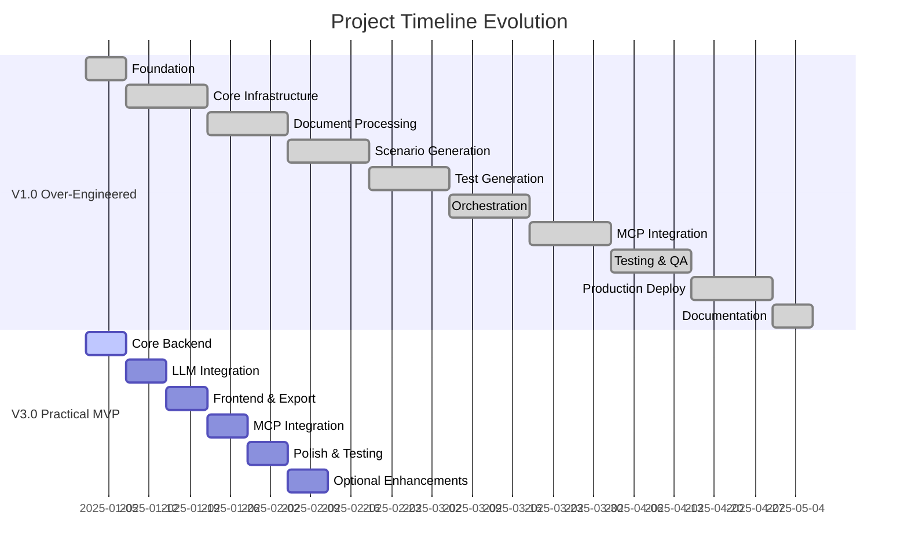
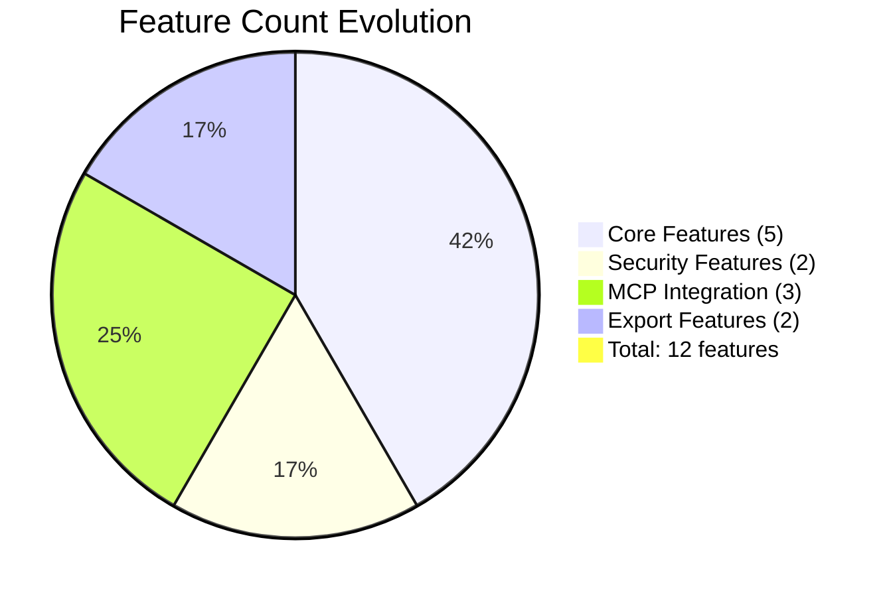

# AI Project Planning Workflow: From Over-Engineering to Practical MVP

> [!info] Teaching Document
> This document demonstrates the complete workflow of refining an AI-generated project plan from over-engineered to practical MVP. Use this as a teaching example for effective AI-assisted project planning.

## 🎯 Learning Objectives

By the end of this workflow, you'll understand:
- How to use AI for initial project planning
- How to identify and correct over-engineering
- How to apply systems thinking analysis
- How to refine plans to focus on core value
- How to document the iterative process for learning

---

## 📋 Workflow Overview

```mermaid
graph TD
    A[AI Initial Planning] --> B[Systems Thinking Analysis]
    B --> C[Gap Identification] go
    C --> D[Practical Refinement]
    D --> E[Implementation Planning]
    E --> F[Teaching Documentation]
    
    A1[18-week timeline<br/>Enterprise stack<br/>50+ features] --> A
    B1[Identify over-engineering<br/>Scope creep analysis<br/>Unrealistic assumptions] --> B
    C1[Critical gaps<br/>High priority fixes<br/>Resource constraints] --> C
    D1[4-6 week timeline<br/>Simple stack<br/>5 core features] --> D
    E1[Phase-based approach<br/>MCP integration<br/>User-centric metrics] --> E
    F1[Archive versions<br/>Teaching guides<br/>Templates] --> F
```

---

## 🚀 Phase 1: AI Initial Planning

### The Starting Point

**Prompt Used:**
```
Create a comprehensive project plan for a QA Scenario Writer that automates BDD scenario generation from Markdown documents. Include technology stack, architecture, timeline, and implementation details.
```

### What AI Generated (V1.0)

> [!warning] Over-Engineering Red Flags
> The AI generated a classic over-engineered plan with these characteristics:

| Component | AI Generated | Red Flag |
|-----------|--------------|----------|
| **Timeline** | 18 weeks | Too long for MVP |
| **Team Size** | 5-10 engineers | Unrealistic for solo dev |
| **Architecture** | Microservices | Premature optimization |
| **Database** | PostgreSQL + Redis | Over-engineered for MVP |
| **Monitoring** | Prometheus + Grafana + Jaeger | Academic perfectionism |
| **Features** | 50+ features | Feature creep |
| **Success Metrics** | BLEU/ROUGE scores | Technical vs user value |

### Key Issues Identified

> [!danger] Common AI Planning Pitfalls
> - **Solution Architecture Mode**: Designed for enterprise scale from day 1
> - **Technology Fetish**: Chose "modern" tools over simple, effective ones
> - **Feature Creep**: Added "nice to have" features as core requirements
> - **Academic Perfectionism**: Aimed for production-grade quality instead of MVP validation
> - **Unrealistic Timeline**: 18 weeks for what should be 4-6 weeks

---

## 🔍 Phase 2: Systems Thinking Analysis

### The Analysis Prompt

**Prompt Used:**
```
Analyze this project plan for over-engineering and scope creep. Focus on what's actually needed for MVP. Identify unrealistic assumptions and suggest simplifications.
```

### Key Insights Discovered

> [!tip] Systems Thinking Questions
> - What's the core value proposition?
> - What's the simplest thing that could work?
> - What features can be deferred to post-MVP?
> - What assumptions are unrealistic?
> - What technology choices are over-engineered?

### Analysis Results (V2.0)

| Issue Category | Problem | Impact | Solution |
|----------------|---------|--------|----------|
| **Scope Creep** | 50+ features | Resource dilution | Focus on 5 core features |
| **Technology Fetish** | Enterprise stack | Complexity | Simple, proven stack |
| **Unrealistic Timeline** | 18 weeks | Project failure | 4-6 week MVP |
| **Academic Perfectionism** | Technical metrics | User disconnect | User-centric metrics |
| **Missing Validation** | No user feedback | Build wrong thing | Early validation plan |

### Gap Analysis

> [!note] Priority Matrix
> - **Critical**: Error handling for LLM failures
> - **High**: Markdown input validation, MCP configuration
> - **Medium**: Resource constraints for solo dev
> - **Low**: Future model integration

---

## ⚡ Phase 3: Practical Refinement

### The Refinement Prompt

**Prompt Used:**
```
Refine this project plan to focus on core value. Create a 4-6 week MVP plan that proves value quickly. Use the simplest technology that works and plan for solo developer.
```

### Transformation Results (V3.0)

| Aspect | V1.0 (Over-Engineered) | V3.0 (Practical MVP) | Change Rationale |
|--------|------------------------|----------------------|------------------|
| **Timeline** | 18 weeks | 4-6 weeks | Realistic for solo dev |
| **Team Size** | 5-10 engineers | Solo developer | Honest assessment |
| **Architecture** | Microservices | Monolith + MCP Docker | Simpler, MCP for agents |
| **Database** | PostgreSQL + Redis | SQLite | No setup needed |
| **Frontend** | React + TypeScript | Streamlit | Rapid development |
| **Features** | 50+ features | 5 core features | Focus on value |
| **Success Metrics** | Technical (BLEU/ROUGE) | User value (time saved) | User-centric |

### Core Value Focus

> [!success] Refined Value Proposition
> **Transform**: Manual Gherkin writing (hours) → Automated scenario generation (minutes)
> **Target**: 70% reduction in BDD authoring time
> **Users**: Developers, QA engineers, product managers

---

## 🛠️ Phase 4: Implementation Planning

### Phase-Based Approach

> [!example] 4-Week Implementation Plan
> **Week 1**: Core Backend (FastAPI + SQLite + Markdown parsing)
> **Week 2**: LLM Integration (Grok API + prompt engineering)
> **Week 3**: Frontend & Export (Streamlit UI + file export)
> **Week 4**: MCP Integration (Docker container + OAuth)

### Technology Stack Rationale

| Technology | Choice | Rationale |
|------------|--------|-----------|
| **FastAPI** | Simple, fast API | Great docs, async support |
| **Streamlit** | Rapid UI development | No frontend complexity |
| **SQLite** | File-based database | No setup required |
| **spaCy** | NLP processing | Proven, not over-engineered |
| **MCP** | Tool exposure | Perfect for external agents |
| **Docker** | Containerization | Simple deployment |

### Success Criteria (Realistic)

> [!check] MVP Success Metrics
> - Generate valid Gherkin from 90% of inputs
> - Complete workflow in <2 minutes
> - Handle 10+ concurrent users
> - Deploy with single Docker command
> - 5+ users actively using the tool
> - 70% reduction in scenario authoring time

---

## 📚 Phase 5: Teaching Documentation

### Archive Structure Created

```
planning/
├── archive/
│   ├── v1.0/                    # Over-engineered version
│   ├── v2.0/                    # Systems thinking analysis
│   └── README.md                # Archive overview
├── teaching/
│   ├── AI_Assisted_Project_Planning_Guide.md
│   ├── Project_Planning_Iteration_Process.md
│   └── AI_Project_Planning_Workflow_Obsidian.md
└── project/
    ├── Project_Summary_2025_v3.0.md    # Current version
    └── Project_Analysis_2025_v3.0.md   # Current analysis
```

### Teaching Materials

> [!book] Comprehensive Teaching Resources
> - **AI Planning Guide**: How to use AI effectively for project planning
> - **Iteration Process**: Detailed step-by-step refinement process
> - **Templates**: Reusable prompts and checklists
> - **Examples**: Concrete before/after comparisons
> - **Best Practices**: Common patterns and solutions

---

## 🎓 Key Learning Points

### What Went Wrong (V1.0)

> [!danger] Common AI Planning Pitfalls
> 1. **Solution Architecture Mode**: Designed for enterprise scale from day 1
> 2. **Technology Fetish**: Chose "modern" tools over simple, effective ones
> 3. **Feature Creep**: Added "nice to have" features as core requirements
> 4. **Academic Perfectionism**: Aimed for production-grade quality instead of MVP validation
> 5. **Unrealistic Timeline**: 18 weeks for what should be 4-6 weeks

### What Went Right (V3.0)

> [!success] Effective AI Planning Practices
> 1. **Core Value Focus**: "Democratize BDD by automating scenario generation"
> 2. **Practical Technology**: FastAPI + Streamlit + SQLite + Docker + MCP
> 3. **Realistic Timeline**: 4-6 weeks for prototype validation
> 4. **Quality That Matters**: "Good enough" scenarios, not academic perfection
> 5. **MCP Integration**: Perfect for tool exposure to external agents

---

## 🔧 High-Quality Example Prompts

### 🚀 Initial Planning Prompts

#### Comprehensive Project Planning

> [!quote] **Prompt 1: Full Project Analysis**
> ```
> I need you to analyze and scaffold a project outline for [PROJECT_DESCRIPTION]. 
> 
> **My Context:**
> - I'm a [EXPERIENCE_LEVEL] developer with [YEARS] years experience in [LANGUAGES]
> - I'm comfortable with [TECHNOLOGIES] but new to [NEW_TECHNOLOGIES]
> - I have [TIME_AVAILABILITY] per day and [BUDGET] budget
> - This needs to integrate with [EXISTING_SYSTEMS]
> - My main goal is [CORE_OBJECTIVE]
> 
> **Specific Ideas I'm Considering:**
> - [SPECIFIC_APPROACH_1] because [REASONING]
> - [SPECIFIC_APPROACH_2] based on [EXPERIENCE/EXAMPLE]
> - I want to avoid [PROBLEMATIC_APPROACH] because [REASON]
> 
> Please consider:
> - All technologies, implementations, and feasibility
> - Make informed suggestions based on 2025 best practices
> - Look for other implementations and precedents
> - Structure a plan of action with implementation phases
> - Call out any gaps or risks
> - Use latest information from 2025
> 
> Structure the documentation in bite-sized chunks for effective iteration. 
> This will be used to prompt an agent to work on specific tasks, so make it 
> high-quality markdown with clear instructions for AI agents.
> ```

#### Technology-Focused Planning

> [!quote] **Prompt 2: Technology Stack Analysis**
> ```
> Create a modern technology stack for a [PROJECT_TYPE] that:
> 
> **My Specific Requirements:**
> - Handles [SPECIFIC_REQUIREMENTS] - [DETAILED_DESCRIPTION]
> - Supports [USER_COUNT] concurrent users - [EXPECTED_GROWTH]
> - Processes [DATA_VOLUME] of data - [DATA_TYPES_AND_FORMATS]
> - Integrates with [EXTERNAL_SERVICES] - [SPECIFIC_APIS_AND_PROTOCOLS]
> - Deploys on [DEPLOYMENT_TARGET] - [INFRASTRUCTURE_CONSTRAINTS]
> 
> **My Personal Context:**
> - Experience: [YEARS] years with [LANGUAGES], new to [NEW_TECHNOLOGIES]
> - Time: [HOURS_PER_DAY] hours per day, [TOTAL_WEEKS] weeks total
> - Budget: [BUDGET_RANGE] - [BUDGET_BREAKDOWN]
> - Preferences: I prefer [TECHNOLOGY_PREFERENCES] because [REASONS]
> - Avoid: I want to avoid [TECHNOLOGIES_TO_AVOID] because [EXPERIENCE]
> 
> **My Ideas and Concerns:**
> - I'm considering [SPECIFIC_TECHNOLOGY] for [USE_CASE] - what do you think?
> - I'm worried about [SPECIFIC_CONCERN] - how can we address this?
> - I've seen [EXAMPLE_PROJECT] use [APPROACH] - is this relevant?
> 
> Please provide:
> 1. Primary technology choices with rationale
> 2. Alternative options and trade-offs
> 3. Implementation complexity assessment
> 4. Learning curve for solo developer
> 5. Long-term scalability considerations
> 6. Address my specific ideas and concerns
> ```

#### Architecture-Focused Planning

> [!quote] **Prompt 3: System Architecture Design**
> ```
> Design a system architecture for [PROJECT_DESCRIPTION] that:
> 
> Core Requirements:
> - [FUNCTIONAL_REQUIREMENT_1]
> - [FUNCTIONAL_REQUIREMENT_2]
> - [FUNCTIONAL_REQUIREMENT_3]
> 
> Non-Functional Requirements:
> - Performance: [PERFORMANCE_TARGETS]
> - Scalability: [SCALE_REQUIREMENTS]
> - Security: [SECURITY_LEVEL]
> - Maintainability: [MAINTENANCE_NEEDS]
> 
> Please provide:
> 1. High-level architecture diagram (Mermaid)
> 2. Component breakdown with responsibilities
> 3. Data flow and integration points
> 4. Technology choices per component
> 5. Deployment architecture
> 6. Security considerations
> 7. Monitoring and observability strategy
> ```

### 🔍 Analysis & Refinement Prompts

#### Over-Engineering Detection

> [!quote] **Prompt 4: Systems Thinking Analysis**
> ```
> Analyze this project plan for over-engineering and scope creep:
> 
> Focus on:
> 1. What's the core value proposition?
> 2. What's the simplest thing that could work?
> 3. What features can be deferred to post-MVP?
> 4. What assumptions are unrealistic?
> 5. What technology choices are over-engineered?
> 6. Is the timeline realistic for a solo developer?
> 
> Provide:
> - Specific over-engineering examples
> - Scope creep identification
> - Unrealistic assumption analysis
> - Technology complexity assessment
> - Timeline feasibility review
> - Concrete simplification recommendations
> ```

#### Gap Analysis

> [!quote] **Prompt 5: Comprehensive Gap Analysis**
> ```
> I've identified these potential gaps in my project plan:
> 
> [LIST_OF_GAPS]
> 
> For each gap, please:
> 1. Assess the priority (Critical/High/Medium/Low)
> 2. Analyze the impact if not addressed
> 3. Suggest specific solutions
> 4. Estimate implementation effort
> 5. Identify dependencies
> 6. Recommend implementation order
> 
> Focus on practical solutions that fit a solo developer timeline.
> ```

#### MVP Refinement

> [!quote] **Prompt 6: MVP Focus Refinement**
> ```
> Refine this project plan to focus on core value:
> 
> **My Specific Constraints:**
> - Solo developer: [EXPERIENCE_LEVEL] with [YEARS] years in [LANGUAGES]
> - Timeline: [TOTAL_WEEKS] weeks, [HOURS_PER_DAY] hours per day
> - Budget: [BUDGET_RANGE] - [SPECIFIC_BUDGET_ALLOCATION]
> - Target users: [USER_DESCRIPTION] - [SPECIFIC_USER_PAIN_POINTS]
> - Must prove value quickly: [SUCCESS_METRICS_I_CARE_ABOUT]
> 
> **My Ideas and Preferences:**
> - I want to focus on [SPECIFIC_FEATURES] because [USER_FEEDBACK/REASONING]
> - I'm particularly interested in [SPECIFIC_TECHNOLOGY] for [USE_CASE]
> - I want to avoid [COMPLEXITY_AREAS] because [EXPERIENCE/CONSTRAINTS]
> - My main hypothesis is [CORE_HYPOTHESIS] - how can we test this?
> 
> **My Questions:**
> - Is [SPECIFIC_APPROACH] too complex for MVP?
> - Should I prioritize [FEATURE_A] or [FEATURE_B] first?
> - How can I validate [SPECIFIC_ASSUMPTION] quickly?
> 
> Refinement goals:
> 1. Create a [TOTAL_WEEKS] week MVP plan
> 2. Use the simplest technology that works
> 3. Focus on user validation
> 4. Defer complexity to post-MVP
> 5. Define realistic success criteria
> 6. Address my specific ideas and questions
> 
> Include:
> - Simplified technology stack
> - Core features only (5-10 max)
> - Realistic timeline with milestones
> - User-centric metrics
> - Clear next steps
> - Post-MVP roadmap
> - Answers to my specific questions
> ```

### 🛠️ Implementation Prompts

#### Phase Planning

> [!quote] **Prompt 7: Implementation Phase Breakdown**
> ```
> Break down this project into implementation phases:
> 
> Project: [PROJECT_DESCRIPTION]
> Timeline: [TOTAL_WEEKS] weeks
> Team: Solo developer
> 
> For each phase, provide:
> 1. Duration and milestones
> 2. Key deliverables
> 3. Technology components to implement
> 4. Dependencies and prerequisites
> 5. Success criteria
> 6. Risk mitigation
> 7. Testing strategy
> 8. Documentation requirements
> 
> Ensure phases build logically and can be validated independently.
> ```

#### Technology Integration

> [!quote] **Prompt 8: Technology Integration Planning**
> ```
> Plan the integration of these technologies for [PROJECT_DESCRIPTION]:
> 
> Technologies:
> - [TECH_1]: [PURPOSE]
> - [TECH_2]: [PURPOSE]
> - [TECH_3]: [PURPOSE]
> - [TECH_4]: [PURPOSE]
> 
> Integration requirements:
> - [INTEGRATION_REQUIREMENT_1]
> - [INTEGRATION_REQUIREMENT_2]
> - [INTEGRATION_REQUIREMENT_3]
> 
> Please provide:
> 1. Integration architecture
> 2. Data flow between components
> 3. API design and contracts
> 4. Error handling strategy
> 5. Testing approach
> 6. Deployment considerations
> 7. Monitoring and debugging
> ```

#### Risk Assessment

> [!quote] **Prompt 9: Risk Assessment and Mitigation**
> ```
> Assess risks for this project plan:
> 
> Project: [PROJECT_DESCRIPTION]
> Timeline: [TIMELINE]
> Team: [TEAM_SIZE] developers
> Budget: [BUDGET]
> 
> Risk categories to analyze:
> 1. Technical risks
> 2. Timeline risks
> 3. Resource risks
> 4. Market/user risks
> 5. Technology risks
> 6. Integration risks
> 
> For each risk, provide:
> - Risk description and impact
> - Probability assessment
> - Mitigation strategies
> - Contingency plans
> - Early warning indicators
> ```

### 📊 Validation & Testing Prompts

#### User Validation

> [!quote] **Prompt 10: User Validation Strategy**
> ```
> Design a user validation strategy for [PROJECT_DESCRIPTION]:
> 
> Target users: [USER_DESCRIPTION]
> Core value proposition: [VALUE_PROP]
> MVP features: [FEATURE_LIST]
> 
> Please provide:
> 1. User research methods
> 2. Validation experiments
> 3. Success metrics
> 4. Feedback collection
> 5. Iteration strategy
> 6. Timeline for validation
> 7. Tools and resources needed
> ```

#### Testing Strategy

> [!quote] **Prompt 11: Comprehensive Testing Strategy**
> ```
> Create a testing strategy for [PROJECT_DESCRIPTION]:
> 
> Technology stack: [TECH_STACK]
> Architecture: [ARCHITECTURE_TYPE]
> User requirements: [USER_REQUIREMENTS]
> 
> Include:
> 1. Unit testing approach
> 2. Integration testing strategy
> 3. End-to-end testing plan
> 4. Performance testing
> 5. Security testing
> 6. User acceptance testing
> 7. Automated testing pipeline
> 8. Testing tools and frameworks
> 9. Test data management
> 10. Quality gates and metrics
> ```

### 📚 Documentation Prompts

#### Technical Documentation

> [!quote] **Prompt 12: Technical Documentation Plan**
> ```
> Create a documentation plan for [PROJECT_DESCRIPTION]:
> 
> Audience: [TARGET_AUDIENCE]
> Project complexity: [COMPLEXITY_LEVEL]
> Team size: [TEAM_SIZE]
> 
> Documentation types needed:
> 1. Architecture documentation
> 2. API documentation
> 3. User guides
> 4. Developer guides
> 5. Deployment guides
> 6. Troubleshooting guides
> 7. Maintenance guides
> 
> For each type, specify:
> - Content structure
> - Target audience
> - Maintenance strategy
> - Tools and formats
> - Review process
> ```

#### Teaching Documentation

> [!quote] **Prompt 13: Teaching Documentation Strategy**
> ```
> Design documentation for teaching [PROJECT_DESCRIPTION] to others:
> 
> Learning objectives: [LEARNING_OBJECTIVES]
> Target audience: [STUDENT_LEVEL]
> Teaching context: [TEACHING_CONTEXT]
> 
> Create:
> 1. Step-by-step tutorials
> 2. Common pitfalls and solutions
> 3. Best practices guide
> 4. Troubleshooting reference
> 5. Example implementations
> 6. Exercise and practice materials
> 7. Assessment criteria
> 8. Resource recommendations
> ```

### 🎯 Specialized Prompts

#### AI Integration

> [!quote] **Prompt 14: AI Integration Planning**
> ```
> Plan AI integration for [PROJECT_DESCRIPTION]:
> 
> AI capabilities needed: [AI_REQUIREMENTS]
> Data sources: [DATA_SOURCES]
> Performance requirements: [PERFORMANCE_NEEDS]
> 
> Consider:
> 1. AI model selection and rationale
> 2. Data preprocessing requirements
> 3. Model training and fine-tuning
> 4. Inference architecture
> 5. Performance optimization
> 6. Cost considerations
> 7. Fallback strategies
> 8. Monitoring and evaluation
> 9. Ethical considerations
> 10. Integration with existing systems
> ```

#### MCP Integration

> [!quote] **Prompt 15: MCP Integration Strategy**
> ```
> Design MCP (Model Context Protocol) integration for [PROJECT_DESCRIPTION]:
> 
> Tools to expose: [TOOL_LIST]
> Target agents: [AGENT_TYPES]
> Security requirements: [SECURITY_NEEDS]
> 
> Plan:
> 1. MCP server architecture
> 2. Tool definition and interfaces
> 3. Authentication and authorization
> 4. Rate limiting and quotas
> 5. Error handling and logging
> 6. Testing strategy
> 7. Deployment considerations
> 8. Monitoring and observability
> 9. Documentation for agents
> 10. Version management
> ```

### 🔄 Iteration Prompts

#### Plan Refinement

> [!quote] **Prompt 16: Iterative Plan Refinement**
> ```
> Refine this project plan based on [FEEDBACK_SOURCE]:
> 
> Current plan: [CURRENT_PLAN]
> Feedback received: [FEEDBACK_DETAILS]
> New constraints: [NEW_CONSTRAINTS]
> 
> Refinement goals:
> 1. Address specific feedback points
> 2. Incorporate new constraints
> 3. Improve feasibility
> 4. Maintain core value proposition
> 5. Optimize for success
> 
> Provide:
> - Updated plan with changes highlighted
> - Rationale for each change
> - Impact assessment
> - Next steps
> - Validation strategy
> ```

#### Lessons Learned

> [!quote] **Prompt 17: Lessons Learned Analysis**
> ```
> Analyze lessons learned from [PROJECT_PHASE]:
> 
> What worked well: [SUCCESSES]
> What didn't work: [FAILURES]
> Unexpected challenges: [CHALLENGES]
> 
> Extract:
> 1. Key insights and patterns
> 2. Best practices discovered
> 3. Common pitfalls to avoid
> 4. Process improvements
> 5. Template refinements
> 6. Tool recommendations
> 7. Team dynamics insights
> 8. Documentation improvements
> ```

---

## 🎯 Prompt Usage Guidelines

### When to Use Each Prompt Type

| Scenario | Recommended Prompts | Purpose |
|----------|-------------------|---------|
| **Starting a new project** | 1, 2, 3 | Comprehensive planning |
| **Feeling overwhelmed** | 4, 5, 6 | Analysis and simplification |
| **Ready to implement** | 7, 8, 9 | Implementation planning |
| **Need validation** | 10, 11 | Testing and validation |
| **Creating documentation** | 12, 13 | Documentation strategy |
| **AI/MCP integration** | 14, 15 | Specialized integration |
| **Iterating on plans** | 16, 17 | Continuous improvement |

### Prompt Customization Tips

> [!tip] **Effective Prompt Customization**
> 1. **Replace placeholders** with specific project details
> 2. **Add context** about your constraints and goals
> 3. **Specify output format** (markdown, tables, diagrams)
> 4. **Include examples** from similar projects
> 5. **Set clear boundaries** (what's in/out of scope)
> 6. **Request specific deliverables** (timeline, architecture, etc.)
> 7. **Ask for rationale** behind recommendations
> 8. **Request alternatives** and trade-offs

### Adding Your Own Context and Ideas

> [!example] **Context Integration Examples**
> 
> **Personal Constraints:**
> ```
> I'm a solo developer with 5 years of Python experience but new to [TECHNOLOGY]. 
> I have 2 hours per day available and prefer working with [PREFERRED_TOOLS]. 
> My budget is [BUDGET] and I need this running by [DEADLINE].
> ```
> 
> **Existing Systems:**
> ```
> This needs to integrate with our existing [SYSTEM_NAME] which uses [TECH_STACK]. 
> We already have [EXISTING_INFRASTRUCTURE] and can't change [CONSTRAINTS]. 
> The team is familiar with [TECHNOLOGIES] but not [NEW_TECHNOLOGIES].
> ```
> 
> **Specific Ideas:**
> ```
> I'm thinking about using [SPECIFIC_APPROACH] because [REASONING]. 
> I've seen [EXAMPLE_PROJECT] do something similar with [TECHNIQUE]. 
> I want to avoid [PROBLEMATIC_APPROACH] because [EXPERIENCE].
> ```
> 
> **Domain Knowledge:**
> ```
> In our industry, [DOMAIN_SPECIFIC_REQUIREMENT] is critical. 
> Users typically expect [BEHAVIOR_PATTERN] and we need to handle [EDGE_CASE]. 
> Compliance with [REGULATION] is mandatory.
> ```

### Context Integration Strategies

> [!note] **How to Add Your Context Effectively**
> 
> **1. Replace Generic Placeholders:**
> ```
> ❌ Generic: "Create a modern technology stack for a [PROJECT_TYPE]"
> ✅ Specific: "Create a modern technology stack for a BDD scenario generation tool that processes Markdown documents and generates Gherkin features"
> ```
> 
> **2. Add Personal Constraints:**
> ```
> ❌ Generic: "Solo developer (me)"
> ✅ Specific: "Solo developer with 3 years Python experience, 1 year FastAPI, new to MCP, 2 hours/day availability, $500 budget"
> ```
> 
> **3. Include Existing Context:**
> ```
> ❌ Generic: "Integrates with [EXTERNAL_SERVICES]"
> ✅ Specific: "Integrates with our existing Jira API (REST), Confluence for documentation, and GitHub for version control"
> ```
> 
> **4. Specify Your Ideas:**
> ```
> ❌ Generic: "Use the simplest technology that works"
> ✅ Specific: "Use the simplest technology that works, but I'm particularly interested in MCP for tool exposure and Streamlit for rapid UI development"
> ```
> 
> **5. Add Domain Knowledge:**
> ```
> ❌ Generic: "Handles [SPECIFIC_REQUIREMENTS]"
> ✅ Specific: "Handles BDD scenario generation from user stories, must support Given-When-Then syntax, needs to export .feature files for Cucumber"
> ```

### Context Template Library

> [!book] **Ready-to-Use Context Templates**
> 
> **Personal Developer Profile:**
> ```
> I'm a [EXPERIENCE_LEVEL] developer with [YEARS] years of experience in [PRIMARY_LANGUAGES]. 
> I'm comfortable with [TECHNOLOGIES] but new to [NEW_TECHNOLOGIES]. 
> I prefer [WORKING_STYLE] and have [TIME_AVAILABILITY] per day. 
> My budget is [BUDGET] and I need this by [DEADLINE].
> ```
> 
> **Project Context:**
> ```
> This project is for [TARGET_USERS] who need to [CORE_PROBLEM]. 
> The main value proposition is [VALUE_PROP]. 
> It needs to integrate with [EXISTING_SYSTEMS] and comply with [REQUIREMENTS]. 
> Success means [SUCCESS_CRITERIA].
> ```
> 
> **Technical Preferences:**
> ```
> I prefer [TECHNOLOGY_CHOICES] because [REASONS]. 
> I want to avoid [TECHNOLOGIES_TO_AVOID] because [EXPERIENCE]. 
> I'm particularly interested in [SPECIFIC_TECHNOLOGIES] for [USE_CASES]. 
> Performance is [PERFORMANCE_REQUIREMENTS] and security is [SECURITY_LEVEL].
> ```
> 
> **Domain Knowledge:**
> ```
> In [INDUSTRY/DOMAIN], [SPECIFIC_REQUIREMENTS] are critical. 
> Users typically [USER_BEHAVIOR] and expect [EXPECTATIONS]. 
> We need to handle [EDGE_CASES] and comply with [REGULATIONS]. 
> Common challenges include [CHALLENGES].
> ```

### Advanced Context Integration

> [!advanced] **Advanced Context Techniques**
> 
> **1. Multi-Layered Context:**
> ```
> Project: [PROJECT_DESCRIPTION]
> Personal: [YOUR_PROFILE]
> Technical: [TECHNICAL_PREFERENCES]
> Domain: [DOMAIN_KNOWLEDGE]
> Constraints: [SPECIFIC_CONSTRAINTS]
> Goals: [SPECIFIC_GOALS]
> ```
> 
> **2. Context Evolution:**
> ```
> Initial context: [STARTING_CONTEXT]
> Learned from: [EXPERIENCES]
> Updated constraints: [NEW_CONSTRAINTS]
> Current focus: [CURRENT_PRIORITIES]
> ```
> 
> **3. Comparative Context:**
> ```
> Similar to: [SIMILAR_PROJECTS]
> Different from: [DIFFERENT_APPROACHES]
> Better than: [IMPROVEMENTS_OVER_EXISTING]
> Unique because: [UNIQUE_ASPECTS]
> ```
> 
> **4. Iterative Context:**
> ```
> Previous attempt: [WHAT_DIDN'T_WORK]
> Lessons learned: [KEY_INSIGHTS]
> New approach: [REVISED_STRATEGY]
> Validation needed: [WHAT_TO_TEST]
> ```

### Context Quality Checklist

> [!check] **Context Integration Checklist**
> - [ ] **Specific details** instead of generic placeholders
> - [ ] **Personal constraints** clearly stated
> - [ ] **Existing systems** and integration points defined
> - [ ] **Domain knowledge** and industry requirements included
> - [ ] **Technical preferences** and avoidances specified
> - [ ] **Success criteria** and validation methods defined
> - [ ] **Timeline and budget** constraints realistic
> - [ ] **Team dynamics** and collaboration needs addressed
> - [ ] **Risk factors** and mitigation strategies considered
> - [ ] **Learning objectives** and skill development goals

### Real-World Example: Context Integration

> [!example] **Before and After: Adding Context to Prompts**
> 
> **❌ Generic Prompt (Weak):**
> ```
> Create a modern technology stack for a web application that handles user data and integrates with external services.
> ```
> 
> **✅ Context-Rich Prompt (Strong):**
> ```
> Create a modern technology stack for a BDD scenario generation tool that:
> 
> **My Specific Requirements:**
> - Handles Markdown document processing - user stories, acceptance criteria, business requirements
> - Supports 10-50 concurrent users - small team initially, potential growth
> - Processes 100-1000 documents per day - typical team workload
> - Integrates with Jira API (REST), Confluence (REST), GitHub (REST) - existing team tools
> - Deploys on Docker containers - team standard, easy scaling
> 
> **My Personal Context:**
> - Experience: 5 years Python, 2 years FastAPI, new to MCP and Streamlit
> - Time: 2 hours per day, 6 weeks total (60 hours)
> - Budget: $500 total - $200 for LLM APIs, $300 for hosting/tools
> - Preferences: I prefer Python ecosystem, simple deployment, good documentation
> - Avoid: I want to avoid complex microservices, React frontend, Kubernetes
> 
> **My Ideas and Concerns:**
> - I'm considering MCP for tool exposure to external AI agents - what do you think?
> - I'm worried about LLM API costs - how can we optimize token usage?
> - I've seen Streamlit used for rapid prototyping - is this good for production?
> 
> Please provide technology choices that fit my constraints and address my concerns.
> ```

### Context Integration Templates

> [!book] **Quick Context Templates**
> 
> **For Solo Developers:**
> ```
> I'm a [EXPERIENCE_LEVEL] developer with [YEARS] years experience in [LANGUAGES]. 
> I'm comfortable with [TECHNOLOGIES] but new to [NEW_TECHNOLOGIES]. 
> I have [HOURS_PER_DAY] hours per day for [TOTAL_WEEKS] weeks. 
> My budget is [BUDGET] and I need this by [DEADLINE]. 
> I prefer [WORKING_STYLE] and want to avoid [COMPLEXITY_AREAS].
> ```
> 
> **For Team Projects:**
> ```
> Our team has [TEAM_SIZE] developers with [COLLECTIVE_EXPERIENCE]. 
> We're comfortable with [EXISTING_TECHNOLOGIES] but new to [NEW_TECHNOLOGIES]. 
> We have [TIMELINE] and [BUDGET] budget. 
> This needs to integrate with [EXISTING_SYSTEMS]. 
> Our main constraint is [PRIMARY_CONSTRAINT] and we want to avoid [PROBLEMATIC_APPROACHES].
> ```
> 
> **For Domain-Specific Projects:**
> ```
> In [INDUSTRY/DOMAIN], [SPECIFIC_REQUIREMENTS] are critical. 
> Users typically [USER_BEHAVIOR] and expect [EXPECTATIONS]. 
> We need to handle [EDGE_CASES] and comply with [REGULATIONS]. 
> Common challenges include [CHALLENGES] and we want to avoid [COMMON_PITFALLS].
> ```

---

## 📊 Before/After Comparison

### Timeline Evolution



### Technology Stack Evolution

| Component | V1.0 (Over-Engineered) | V3.0 (Practical) | Change |
|-----------|------------------------|------------------|--------|
| **Backend** | FastAPI + Dramatiq + Redis | FastAPI only | Simplified |
| **Database** | PostgreSQL + Redis | SQLite | No setup |
| **Frontend** | React + TypeScript | Streamlit | Rapid dev |
| **Monitoring** | Prometheus + Grafana + Jaeger | Basic logging | MVP focus |
| **Deployment** | Kubernetes | Docker Compose | Solo dev |
| **Architecture** | Microservices | Monolith + MCP | Simpler |

### Feature Count Evolution



---

## 🎯 Best Practices Summary

### Do's ✅

> [!success] Effective AI Planning Practices
> - **Start with AI** for comprehensive initial planning
> - **Apply systems thinking** to identify over-engineering
> - **Focus on core value** before technology choices
> - **Use realistic constraints** (solo dev, 4-6 weeks)
> - **Document the process** for learning and teaching
> - **Iterate based on feedback** from real users

### Don'ts ❌

> [!danger] Common Mistakes to Avoid
> - **Accept AI output** without analysis
> - **Focus on technology** before proving value
> - **Assume enterprise scale** without validation
> - **Aim for perfection** instead of good enough
> - **Skip user validation** in planning
> - **Ignore realistic constraints**

---

## 🚀 Next Steps

### For Implementation

> [!todo] Immediate Actions
> 1. **Start with Week 1** - FastAPI + SQLite + Markdown parsing
> 2. **Get 5-10 real user stories** - For testing and validation
> 3. **Focus on core workflow** - Upload → Generate → Download
> 4. **Measure actual user value** - Not technical metrics

### For Teaching

> [!book] Teaching Applications
> 1. **Use this workflow** as a teaching example
> 2. **Apply templates** to other projects
> 3. **Document iterations** for learning
> 4. **Share best practices** with team
> 5. **Create similar workflows** for other domains

---

## 📝 Conclusion

This workflow demonstrates how to effectively use AI for project planning:

1. **AI generates comprehensive plans** (often over-engineered)
2. **Human analysis identifies issues** (systems thinking)
3. **Refinement focuses on core value** (practical constraints)
4. **Documentation enables learning** (teaching materials)
5. **Iteration improves outcomes** (continuous refinement)

> [!quote] Key Takeaway
> AI is powerful for initial planning, but human oversight and systems thinking are essential for creating practical, implementable solutions.

---

## 🔗 Related Resources

- [[AI_Assisted_Project_Planning_Guide]] - Comprehensive teaching guide
- [[Project_Planning_Iteration_Process]] - Detailed iteration process
- [[Archive Documentation]] - Complete version history
- [[Implementation Phases]] - Current implementation plan

---

*This document serves as a teaching example for effective AI-assisted project planning. Use it to guide others in avoiding common pitfalls and focusing on practical, implementable solutions.*
